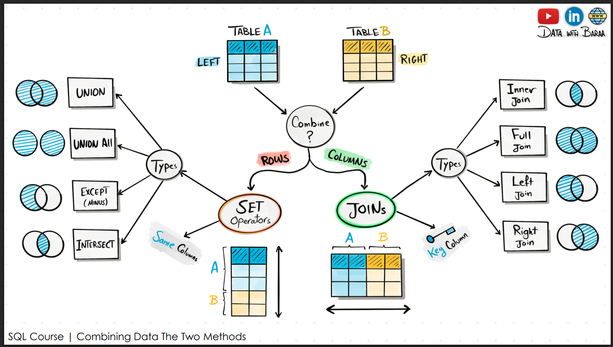
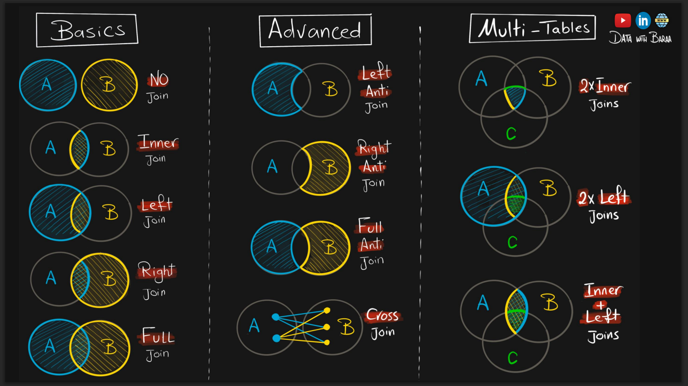

# SQL-Data-Analysis-And-Engineering


 ## Credits 
 This project was developed with guidance from *Data with Baraa*. YouTube Channel: [Data with Baraa](https://www.youtube.com/@DataWithBaraa)

##  About the Project
This repository documents my progression into intermediate and advanced SQL. Moving beyond basic `SELECT` statements, this project focuses on complex relational logic, data transformation, and advanced analytical querying. 

The scripts in this repository bridge the gap between **Data Analysis** (generating business insights, trend analysis, ranking) and **Data Engineering** (handling NULLs, deduplication, data type casting, and delta detection).

##  Key Concepts & Techniques

### 1. Advanced Relational Logic (JOINs & SET Operators)





Understanding how to combine datasets horizontally and vertically is crucial:
* **JOINs (Columns):** Implemented `INNER`, `LEFT`, `RIGHT`, `FULL`, and `CROSS` joins. Explored advanced techniques like **Anti-Joins** (e.g., `LEFT ANTI JOIN`) to find completely unmatching records.
* **SET Operators (Rows):** Combined result sets using `UNION`, `UNION ALL` (performance optimized), `INTERSECT` (common records), and `EXCEPT` (distinct differences). 


### 2. Scalar & Nested Functions (Data Transformation)
Data is rarely clean. I practiced heavily on transforming raw data into usable formats:
* **String Manipulation:** `CONCAT`, `UPPER/LOWER`, `TRIM`, `REPLACE`, `SUBSTRING`, `LEFT/RIGHT`.
* **Date/Time Intelligence:** Extracted specific granularities using `DATEPART`, truncated timestamps using `DATETRUNC`, and calculated durations using `DATEDIFF` and `DATEADD`.
* **Type Casting:** Converted structures using `CAST`, `CONVERT`, and `FORMAT`.

### 3. Data Quality & NULL Handling
Handled missing data strategically to avoid calculation errors (like division by zero) and reporting inaccuracies using `COALESCE`, `ISNULL`, and `NULLIF`. Implemented distinct business policies for distinguishing between `NULL` (unknown), `''` (empty string), and `' '` (blank spaces).

### 4. Window Functions 


Unlike `GROUP BY` which collapses rows, Window Functions perform aggregations while maintaining row-level granularity:
* **Aggregate Windows:** `SUM() OVER(PARTITION BY X)`.
* **Framing / Shifting Windows:** Using `ROWS BETWEEN PRECEDING AND FOLLOWING` to limit calculation bounds.
* **Ranking Windows:** `ROW_NUMBER()`, `RANK()`, `DENSE_RANK()`, `NTILE()`, and percentage-based `CUME_DIST()`.
* **Value Windows:** `LAG()`, `LEAD()`, `FIRST_VALUE()`, `LAST_VALUE()`.

##  Applied Case Studies & Analytical Workflows

This repository isn't just theory; it contains practical solutions to real-world business problems:

* **Data Migration & Delta Detection (Engineering):** Used the `EXCEPT` operator to perform data completeness checks between Source and Target systems during migrations.
* **Deduplication:** Used `ROW_NUMBER() OVER(PARTITION BY...)` to isolate and remove duplicate rows (e.g., cleaning the `OrdersArchive` table).
* **Part-to-Whole & Comparison Analysis:** Calculated what percentage a specific product's sales contributed to overall total sales, and dynamically compared individual sales records against the moving average.
* **ETL Load Balancing & Data Segmentation:** Implemented `NTILE(2)` to dynamically split large datasets into equal buckets for parallel processing and pagination.
* **Trend Analysis (Running & Rolling Totals):** Designed continuous Running Totals (unbounded) and fixed-window Rolling Totals (e.g., 30-day moving averages) to track sales performance over time.
* **Month-over-Month (MoM) Growth:** Utilized `LAG()` to calculate the percentage change in sales from the previous month to the current month.
* **Customer Retention & Loyalty Analysis:** Applied `LEAD()` to calculate the exact number of days between a customer's current order and their next order to gauge purchasing frequency.
* **Top-N & Bottom-N Targeting:** Ranked customers and products using `ROW_NUMBER()` to identify the top performers for marketing campaigns and the lowest performers for risk optimization.
* **Conditional Aggregation (Pivoting Logic):** Used `SUM(CASE WHEN...)` to count specific conditional occurrences without filtering out the rest of the dataset.

##  Tech Stack
* **Language:** SQL 
* **Environment:** SQL Server (SSMS)
* **Core Concepts:** Window Functions, CTEs, Advanced Joins, Set Operators, Data Engineering ETL Logic

##  Getting Started

To explore or run these scripts:
1. Clone the repository:
   ```bash
   git clone [https://github.com/AbdiR0099/SQL_data_analysis_and_engineering.git](https://github.com/AbdiR0099/SQL_data_analysis_and_engineering.git)

2. Set up a Local Database Engine:
   Ensure you have a SQL engine installed (e.g., SQL Server, MySQL, or PostgreSQL).

3. Execute the Script:
   Open the .sql file in your preferred IDE (like Azure Data Studio, SSMS, or DBeaver), execute the highlighted batches to see the transformation and analytical outputs in real-time.
   
